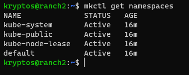
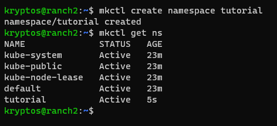
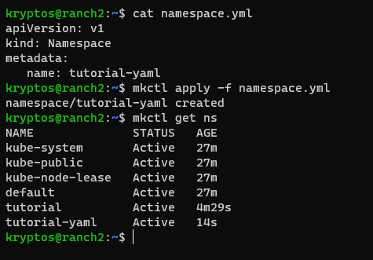
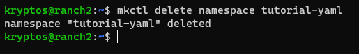
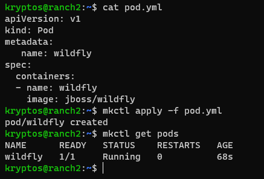
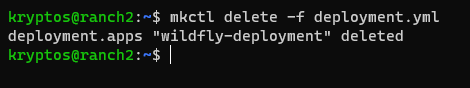
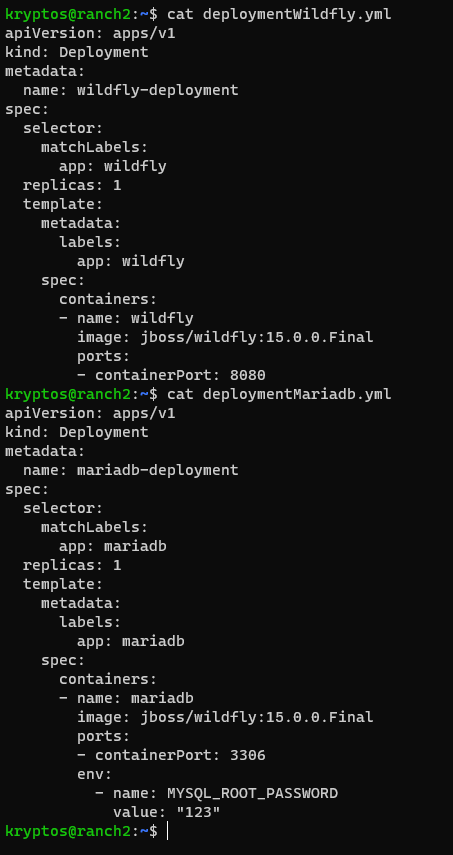
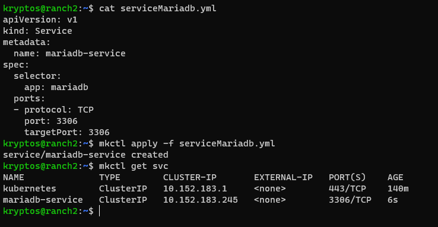

_Hola amigooos. En este post estaremos hablando un poquito de kubernetes._

_¿Que es Kubernetes?_

_Kubernetes (referido en inglés comúnmente como “K8s”) es un sistema de código libre para la automatización del despliegue, ajuste de escala y manejo de aplicaciones en contenedores_


[Wiki](https://es.wikipedia.org/wiki/Kubernetes)

[Recurso](https://kubernetes.io/es/)

_Conceptos Basicos_

* _Namespaces_
    * _Espacios de Trabajos_

* _Pods_
    * _Un contenedor o una serie de contenedores unificados por etiquetas_

* _Deployments_
    * _Manifiesto declarativo de estado para crear Pods y ReplicaSets que el Controlador se encarga de conseguir el estado deseado_

* _Services_
    * _Es un conjunto de pods que trabajan en conjunto, como una capa de una aplicación multicapas_

* _Ingress_
    * _Objeto que nos va a permitir controlar muchos aspectos de nuestra red en nuestro cluster de Kubernetes_


# Tutorial

## Instalacion

_Instalacion con el uso de snap_
```shell
sudo snap install microk8s --class
```
```shell
microk8s status --wait-ready 
```
_Habilitar Addons de MicroK8S_
```shell
microk8s enable dashboard dns storage 
```

_Agregar este alias al bashrc_
```shell
alias mkctl="microk8s kubectl"
```
```shell
source ~/.bashrc
```

_Listo_
```shell
mkctl get namespace
```

## Namespaces

_Ver los namespaces por defecto_



_Creando namespaces_



_Usando YAML_



_Eliminar namespaces_



## Pods

_Crear un pod_



_Nota: Para ver mas informacion sobre el Pod_
```shell
mkctl describe pod wildfly
``` 

_Acceso a un Pod_


_Ver logs de de un  pods_

```shell
mkctl logs -f wildfly

=========================================================================

  JBoss Bootstrap Environment

  JBOSS_HOME: /opt/jboss/wildfly

  JAVA: /usr/lib/jvm/java/bin/java

  JAVA_OPTS:  -server -Xms64m -Xmx512m -XX:MetaspaceSize=96M -XX:MaxMetaspaceSize=256m -Djava.net.preferIPv4Stack=true -Djboss.modules.system.pkgs=org.jboss.byteman -Djava.awt.headless=true  --add-exports=java.base/sun.nio.ch=ALL-UNNAMED --add-exports=jdk.unsupported/sun.misc=ALL-UNNAMED --add-exports=jdk.unsupported/sun.reflect=ALL-UNNAMED

=========================================================================

16:08:12,663 INFO  [org.wildfly.extension.undertow] (MSC service thread 1-2) WFLYUT0006: Undertow HTTPS listener https listening on 0.0.0.0:8443
16:08:12,849 INFO  [org.jboss.ws.common.management] (MSC service thread 1-1) JBWS022052: Starting JBossWS 5.4.2.Final (Apache CXF 3.3.7)
16:08:12,984 INFO  [org.jboss.as.server] (Controller Boot Thread) WFLYSRV0212: Resuming server
16:08:12,986 INFO  [org.jboss.as] (Controller Boot Thread) WFLYSRV0025: WildFly Full 21.0.2.Final (WildFly Core 13.0.3.Final) started in 6641ms - Started 317 of 579 services (370 services are lazy, passive or on-demand)
16:08:12,987 INFO  [org.jboss.as] (Controller Boot Thread) WFLYSRV0060: Http management interface listening on http://127.0.0.1:9990/management
16:08:12,988 INFO  [org.jboss.as] (Controller Boot Thread) WFLYSRV0051: Admin console listening on http://127.0.0.1:9990
```

## Deployments

_Crear Deployment_


_Al aplicar el despliegue se nos crea el pod que declaramos en el archivo yaml_


_Eliminar Deployment_



## Services

_Crear un Service_

- Crear un Deployment





_Hasta la proxima..._